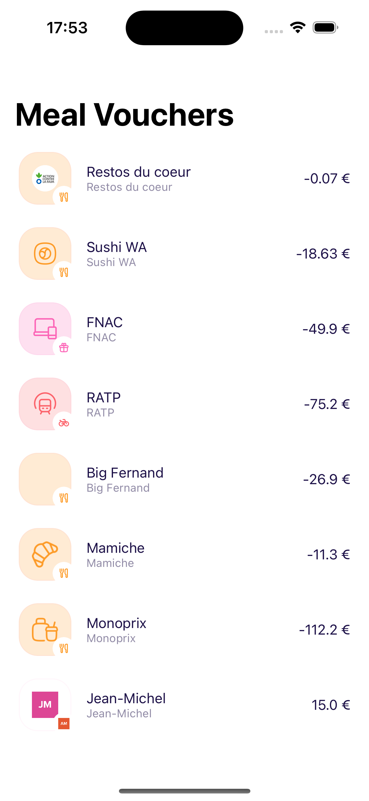
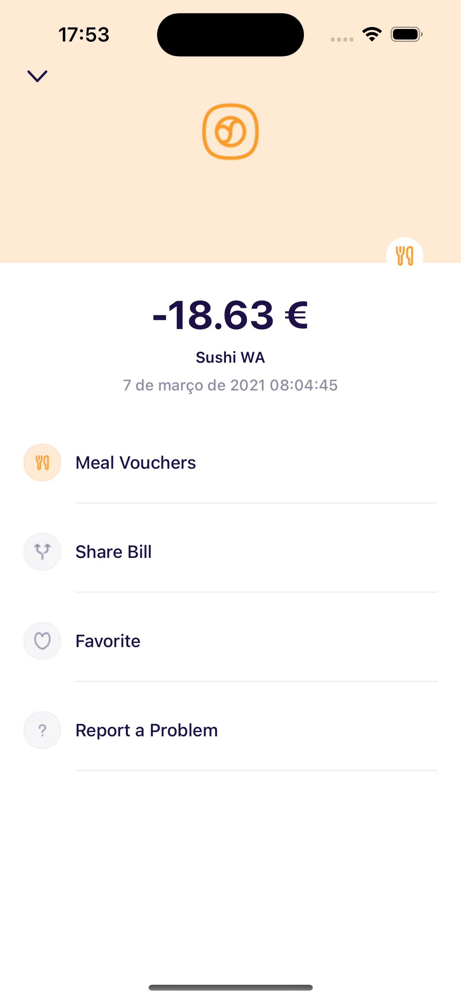
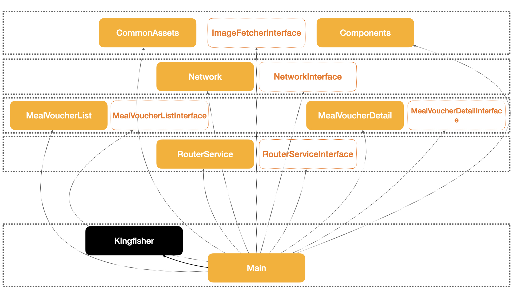
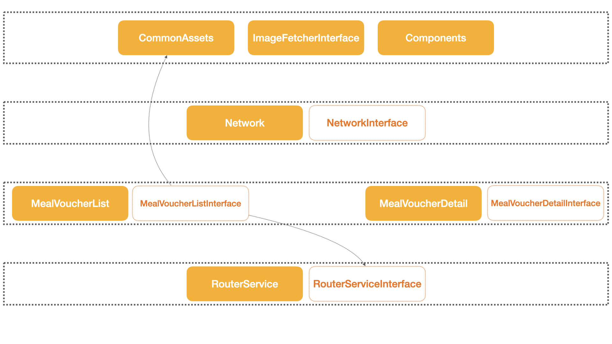
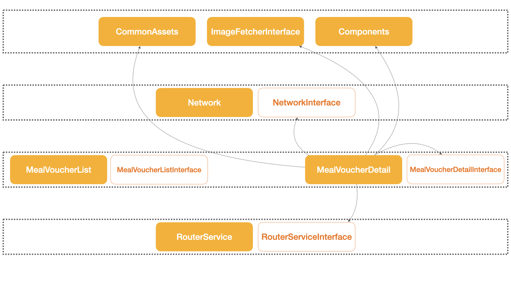

# Meal Voucher App
- Current macOS Version: 13.2 (Ventura) or later
- Current Xcode Version: 14.2
- Current iOS Minimum Deployment Target: 16.2
- Current Swift Version: 5.7

### Screens
| List | Detail |
|--|--|
|  |  | 

# Codebase Description
- **UIKit** as UI framework
- **MVC** as UI design pattern
- **Modular Architecture** using _Feature Interface_ concept and SPM to handle it
- **Swift Package Manager** as dependency manager

# Libraries/Frameworks
This project uses Swift Package Manager as dependency manager

### Third Party Libraries
- Dependency Injection: [Router Service](https://github.com/rockbruno/RouterService)
- Image downloader: [Kingfisher](https://github.com/onevcat/Kingfisher)

# Dependency graph
Based in this [article](https://swiftrocks.com/reducing-ios-build-times-by-using-interface-targets) this project was buit using interface modules with a DI container. "Interface" modules don't contain any concrete code or dependencies -- they just contain protocols that are used by the modules that depend on it to reference some piece of code that is defined in the real, concrete module. 
In terms of build time, because features doesn't depend of another feature, changes to concrete modules will not recompile the entire project or it dependencies avoiding a massive boost in build performance!
It also helps to keep feature modules contained and each module can use whichever UI design pattern (I presented [this talk](https://youtu.be/eXvzhPJEbtM) where I mentioned that) it prefers from an isolated module.

## Main app

## Meal voucher list 
### Concrete Module

### Interface Module

## Meal voucher detail 
### Concrete Module

### Interface Module
